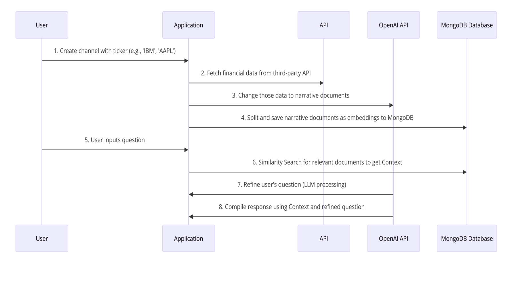

# Financial Analytic Chat app - Ngo Gia Duc

Email: duc.ngogia2002@gmail.com

### Link Demo:
I also built CI/CD pipeline for this application. I deployed the application on AWS ECS. Detail in _infrastructure folder

Try it now: [Demo](http://ecsclu-chata-sqcmtc8ivsc7-626708928.eu-west-1.elb.amazonaws.com/)

### Sample Image:

### Relevant Project:
Check out this chat app that I made few months ago! It uses a language model to summarize news and lets you chat with a bot for more details about the news

Check out repo README first!!!

Link Github: [News App](https://github.com/DwcQuocXa/OpenAI-news-app)

## Tasks Status
Complete all the tasks

### React Frontend
- [x] Render a full page application with three panels.
- [x] Navigation panel shows a list of channels.
- [x] Message list panel shows a list of message bodies for one channel.
- [x] Editor panel shows a text area input.
- [x] Editor panel is hidden if there is no channel selected.
- [x] Editor has a submit button.
- [x] Submit button is disabled if there is no text in message body.
- [x] Clicking a channel in navigation panel selects that channel.
- [x] Entering text in editor and clicking submit adds message to the currently selected channel.
- [x] Submitting editor clears input.
- [x] Switching channels clears input.
- [x] Channel list is loaded once on loading the application.
- [x] Initially no channel is selected.
- [x] Messages are loaded from remote on channel selection and updated to screen.
- [x] Messages are also stored to local state after loading from remote.
- [x] Editing is not required, only creation.
- [x] Upon submitting a message to a channel, that message is available for other users.
- [x] Submitting user sees message in message list after submitting.
- [x] Render created message in the list immediately before refreshing from backend.

### ExpressJs Backend
- [x] Channel and message storage can be an in-memory database.
- [x] On server start, storage is populated with a fixed set of empty channels.
- [x] GET endpoint for querying channels.
- [x] GET endpoint for querying channel’s messages.
- [x] POST endpoint for submitting new messages to a channel.

## Additional Features
Chatbot in order to analyze fundamental financial data of a company.
- [x] Channel Creation: User creates a channel named with a company's stock ticker (e.g., "IBM", "AAPL").
- [x] Data Retrieval: The backend system retrieves the company's financial data (income, balance sheet, earnings) from Alpha Vantage via API.
- [x] Data Storage: Financial data is stored in JSON files within a 'dummyData' folder.
- [x] User Interaction: The user asks a question by sending a message to the chatbot in the channel.
- [x] Data Filtering: For each user question, the application uses the LLM to query and filter relevant data from the JSON files.
- [x] Question Refinement: The application uses the LLM to reformulates the user's question to make it more suitable.
- [x] Answer Generation: The application uses the LLM to generate an answer to the user's question.

### App Workflow

## Instructions

### Backend
- ENVIRONMENT VARIABLES:
    - `PORT=4000`
    - `OPENAI_API_KEY=OPENAI_API_KEY`
    - `ALPHA_VANTAGE_API_KEY=ALPHA_VANTAGE_API_KEY`
- Setup:
    - Change directory to the backend directory: `cd backend`.
    - Create the `.env` file and place the variables into it.
    - Install dependencies: `npm install`.
    - Run in development mode: `npm start`.

### Frontend
- ENVIRONMENT VARIABLES:
    - `REACT_APP_API_URL=http://localhost:4000`
- Setup:
    - Change directory to the backend directory: `cd frontend`.
    - Create the `.env` file and place the variables into it.
    - Install dependencies: `npm install`.
    - Run in development mode: `npm start`.

## Run with Docker

### Prerequisites
- Docker
- docker-compose

### Run in Local with docker-compose
- Run: `docker-compose up -d`
- Access the Application: Open http://localhost:3000

